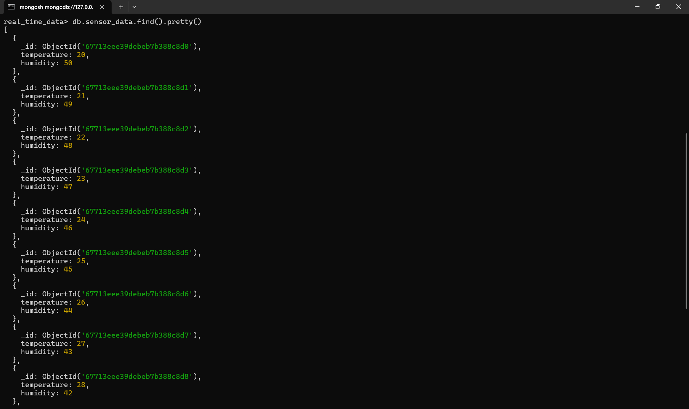

# Kafka Real-Time Data Pipeline 🚀

This project implements a real-time data pipeline using **Apache Kafka**, **MongoDB**, and **Python**. It streams sensor data (temperature and humidity) from a Kafka producer, consumes and processes the data through a Kafka consumer, stores the data in MongoDB, and visualizes the trends of the data.

## Project Overview 🔍

The Kafka Real-Time Data Pipeline project is designed to:
- Stream sensor data from a Kafka producer.
- Process and store the data in real-time using Kafka consumer.
- Store the processed data in MongoDB for persistence.
- Visualize trends in the data (temperature and humidity) using Python's data visualization libraries.

## Key Features 🌟
- **Real-time data streaming**: Data is streamed and processed in real-time with Kafka.
- **Data storage**: Processed data is stored in MongoDB for future analysis and retrieval.
- **Data visualization**: Visualize trends in the sensor data with Python's data visualization tools like Matplotlib.
  
## Technologies Used ⚙️
- **Apache Kafka**: A distributed event streaming platform used for building real-time data pipelines.
- **MongoDB**: A NoSQL database used for storing the processed sensor data.
- **Python**: The programming language used for implementing the Kafka producer, consumer, and data processing scripts.
- **Matplotlib**: A library used for visualizing the temperature and humidity trends.

## Screenshots 📸

### Kafka Server Startup
This image displays the startup of the Kafka server.

### Zookeeper Startup
This image shows the Zookeeper service startup, which is required to manage Kafka brokers.

### Kafka Producer Output
This image shows the terminal output when running the Kafka producer to send real-time data to the topic.

### Console Output
This image shows the Kafka consumer receiving real-time sensor data.

### Kafka Consumer Output
This image shows the terminal output when running the Kafka consumer to receive real-time data from the topic and storing it in the database.

### MongoDB Data Storage
This image shows the real-time data stored in MongoDB.

### Data Visualization
  
*Visualization of temperature and humidity trends using Matplotlib.*

 
*Visualization of Subplots of temperature and humidity trends using Matplotlib.*

## About the Developer 🛠️💡
This project is developed by **Nakshatra Deshmukh**, a third-year computer engineering student. The goal of this project was to build a **real-time data pipeline** using **Apache Kafka**, **MongoDB**, and **Python**. 

If you have any questions or feedback about the project, feel free to reach out!

**Contact** 📧: [nakshatrad5075@gmail.com](mailto:nakshatrad5075@gmail.com)
